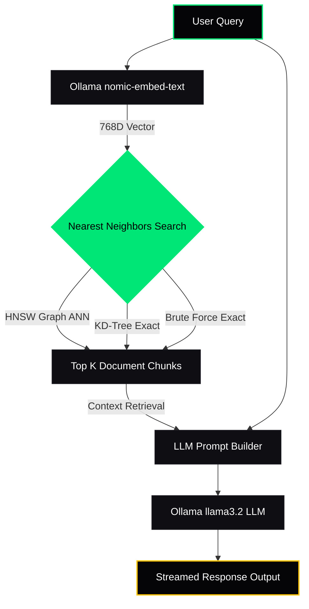
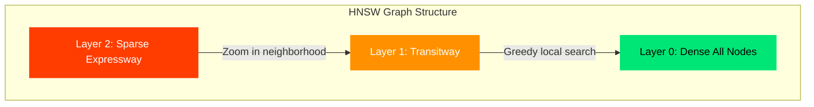

# NeuraX — Vector Intelligence Platform

**NeuraX** is a custom-engineered, in-memory **Vector Database** and **Retrieval-Augmented Generation (RAG) pipeline** designed for lightning-fast semantic retrieval and local intelligence. Optimized for **macOS** and powered by a **Python FastAPI backend** and a premium, responsive **glassmorphic dark UI**, NeuraX implements high-performance search algorithms and PCA-based multidimensional vector visualization side-by-side.

---

## ⚡ Core Architecture

NeuraX orchestrates text processing, high-dimensional indexing, and AI generation into a seamless, unified local pipeline:

---

## 🚀 Key Features

### 1. Multi-Algorithmic Vector Search
NeuraX features three core search algorithms running side-by-side so you can evaluate performance and accuracy tradeoffs in real-time:
* **HNSW (Hierarchical Navigable Small World)**: A production-grade approximate nearest neighbor (ANN) search graph algorithm. By constructing a multi-layer graph index, it achieves logarithmic $O(\log N)$ search complexity, making it scale effortlessly to high dimensions.
* **KD-Tree (K-Dimensional Tree)**: A spatial partitioning tree structured to divide high-dimensional coordinates. It provides exact nearest neighbor searches but degrades in speed as dimensions grow due to the *curse of dimensionality*.
* **Brute Force (Flat Index)**: The exact search baseline that calculates distance metrics across every node in the database. Operates at linear $O(N)$ complexity.

### 2. Multi-Metric Distance Support
Supports three standard mathematical formulas to calculate similarity or distance vectors:
* **Cosine Similarity**: Measures the angular cosine between vectors (perfect for text and semantic comparisons).
* **Euclidean Distance**: Calculates the straight-line distance in Euclidean space.
* **Manhattan Distance**: Calculates distance along axis-aligned grid paths.

### 3. High-Tech 2D PCA Visualizer
* Displays 16-dimensional semantic demo vectors projected down to a 2D coordinate space using Principal Component Analysis (PCA).
* Renders real-time connections, crawling neon pulses from the target to its K-nearest neighbors, and concentric sonar radar waves to illustrate the search sweep.
* Displays a dedicated **Category Legend** in the side panel showing color-coded vectors mapped across *CS/Algorithms*, *Mathematics*, *Food & Cooking*, *Sports & Games*, and *Ingested Documents*.

### 4. Semantic Document Ingestion
* Automatically splits long documents into overlapping 250-word chunks.
* Connects to local Ollama endpoints to generate 768-dimensional embeddings using `nomic-embed-text`.
* Stores document chunks in an independent, high-performance HNSW index.

### 5. Local AI Core (RAG Pipeline)
* Interrogates your document database with user-defined **Context Depth** ($K$) parameters.
* Retrieves the top $K$ context chunks, packages them into a clean system prompt context, and streams the answer using local LLMs (e.g. `llama3.2` or `llama3.2:1b`).
* Formats streamed outputs with clean code blocks, custom scrollbars, and user-friendly chat bubbles.

### 6. Neural Analytics & Benchmarking
* Displays search latency metrics down to the microsecond level.
* Features a real-time **Benchmarks** visualizer showing execution times for each algorithm, highlights the **FASTEST** algorithm with a neon badge, and calculates the exact speedup ratio.
* Visualizes active node levels and layer topologies for HNSW indexing graphs.

---

## 🛠 Tech Stack

* **Frontend**: Vanilla CSS (Premium Glassmorphic Dark UI), HTML5 Canvas (Visualizer), JavaScript (DOM, Fetch API).
* **Backend**: Python 3.14+ (FastAPI, Uvicorn, NumPy).
* **AI Engine**: Ollama Local API (`nomic-embed-text` and `llama3.2`).
